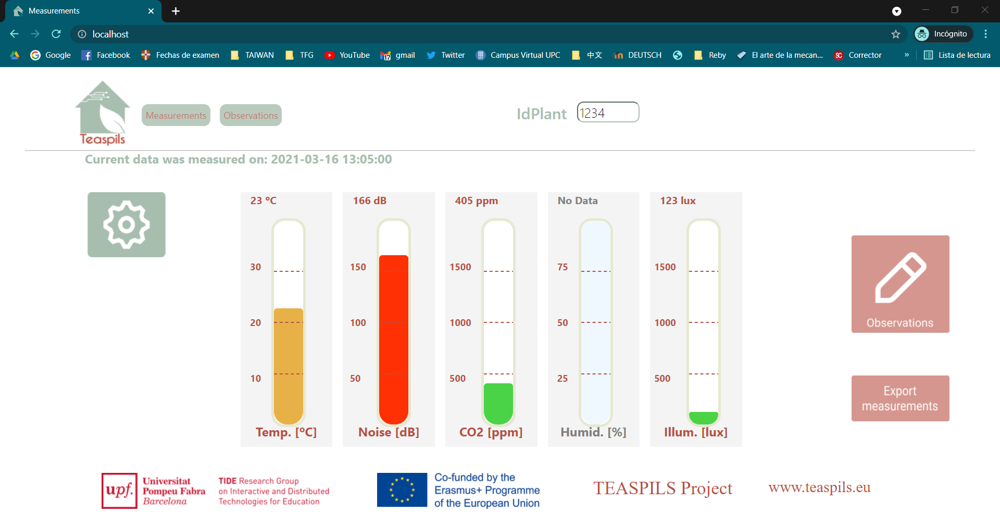
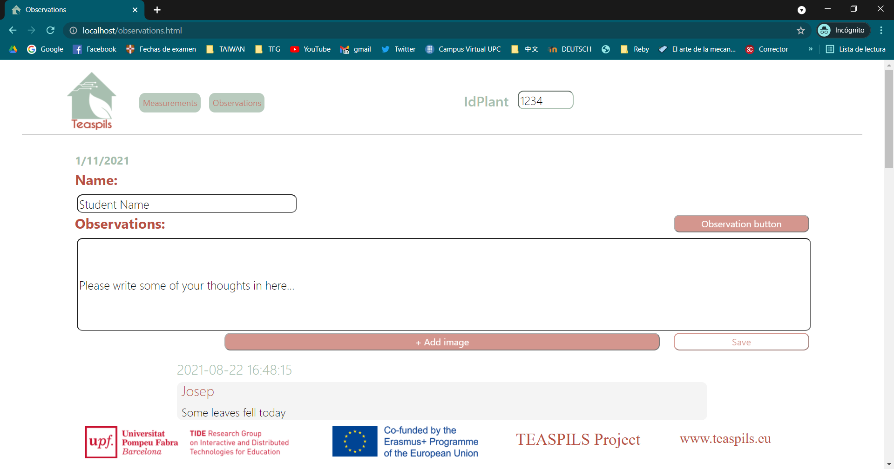

# Designing a human-centred dashboard

Project in collaboration with the TIDE research group of the Universitat Pompeu Fabra University. Supervised by Dr. Hernandez-Leo. 

In recent years, the pandemic has increased concern about maintaining healthy work spaces that minimize the transmission of the virus. More specifically, multiple educational institutions have adopted policies that include IoT systems that monitor CO2 and alert when a classroom or shared space needs to be ventilated. When it comes to dashboards that provide insight into the internal state of the air in a space, research shows great diversity. Basic dashboards used in an indoor air quality context often have limited or non-existent interaction features and are built to provide information only. However, more advanced solutions which use IoT technology and applications to display measured parameters from the environment such as temperature, humidity, etc. provide users with an insight into the situation as well as the opportunity to influence it.

This is why, under the context of the Teaspils european project (https://www.teaspils.eu/), a first MVP of a human-centred dashboard has beeen developed in order to monitor the classroom main metrics (light, temperature, humidity...) as well as keep the records of how plants evolve in such environment. To do so, a smart planter with IoT sensors has been used. The dashboard contains two main pages: Measurements and Observations. 

The measurements page contains different thermometer-like shaped charts that display in real time the value for each of the metrics of the plant, such as soil humidity, CO2 concentation or light. 

The second page contains different observations that are made by students. Any observation worth recording can be stored in the second page together with images and the students own feelings. 

The dashboard is uniquely connected with one smart planter that is located within a specific classroom. Thus, the main enviromental metrics of the classroom can be monitored while allowing students to understand how a plant evolves with time and how is its health related to its environment factors. 
